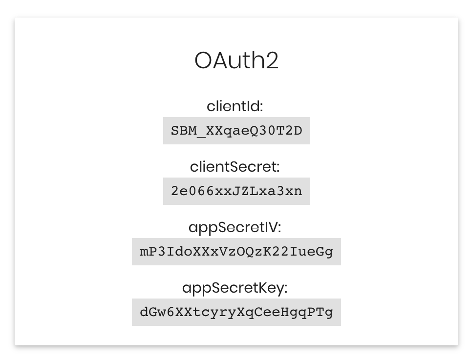

[](https://travis-ci.com/sparkassen-hub/ahoi-appservice-express)

# AHOI Node.js demo app with Express or Fastify


This simple demo app shows how to easily get data e.g. transactions from different banking accounts
using the AHOI Open Banking API.

## Installation and Start

1. If not already done, install Node.js on your computer. Installation instruction can be found
   here: [Node.js download](https://nodejs.org/en/download/).
   You must use at least version 10.0.0 or higher.
  
   We recommended (it is optional) to install the Node Version
   Manager (NVM) as it allows to use different versions of Node.js for different applications.
   * [NVM Mac / Linux](https://github.com/creationix/nvm#install-script)
   * [NVM Windows](https://github.com/coreybutler/nvm-windows)

2. Clone this project or download and unpack it on your computer (see the green button 'Clone or
   Download' above)

3. Configure the application with the AHOI credentials. You have to register a demo account at ([AHOI
   Demo-Account](https://banking-sandbox.starfinanz.de/sandboxmanager/)) first to do this.

4. After registration at AHOI open the application configuration file in a text editor:
   <PROJECT_DIR>/config/env.development. Add the AHOI secrets which you find within your AHOI sandbox
   account.
   
   Add the configuration for the following items:
   * AHOI_CLIENTID
   * AHOI_CLIENTSECRET
   * AHOI_APPSECRETIV
   * AHOI_APPSECRETKEY

   Additionally you should set an encryption key for an additonial security layer. You can use any
   password for that:
   * AHOI_CRYPTKEY

   Note: you should make the configuration file hidden by renaming it into .env.development as it
   contains passwords. The hidden configuration file is excluded from GIT commits.

5. Open the console and change to the directory where you have cloned or unpacked the project, e.g. /user/development/ahoi-nodejs-demo-app

6. Install the application dependencies. This may take some time.

   ```bash
   npm i
   ```

7. Start the server

    ```bash
    # development
    npm run watch

    # production
    npm run build
    npm start
    ```

8. Test if the application works. Open in your browser:
    * [http://localhost:3000/testahoi](http://localhost:3000/testahoi)
    * [http://localhost:3000/installationid](http://localhost:3000/installationid).

   You should get an AHOI JWT token and an installationid

9. If everything works fine, it's time to launch the simple app.

    Open the following URL in your browser and follow the explanations:
    * [http://localhost:3000/start.html](http://localhost:3000/start.html)

## Next Steps / Tipps

### Documentation

* [AHOI Cookbook](https://banking-sandbox.starfinanz.de/ahoi/docs/cookbook/index.html)
* [AHOI
  Explorer](https://banking-sandbox.starfinanz.de/ahoi/docs/api/swagger-ui/index.html#!/resource/Access)
* [AHOI API Docs](https://sparkassen-hub.github.io/ahoi-swagger-fetchclient)
* [AHOI Node.js Client](https://sparkassen-hub.github.io/ahoi-nodejs-client/classes/AhoiApiFactory.html)

### Logging

This application uses [winston](https://github.com/winstonjs/winston) logger in the background. But
to make it as simple as possible console log messages (console.log, console.info, ...) are
redirected to winston logger and saved in log files. You can find the log files in the folder /logs.

If you want to change the log level, it can be set in the configuration file
(/config/env.development).

### Create a new controller e.g. using the AHOI forecast API

Create a new controller class or copy an existing one e.g. /helloworld.controller.ts or
accounts.controller.ts.

Create methods with endpoints, e.g.:

```typescript
@GET('/balanceforecast')
public async getBalanceForecast(@USER() user: any,
                                @QUERYPARAM('accessid', Validator_UUIDRequired) accessid: string,
                                @QUERYPARAM('accountid', Validator_UUIDRequired) accountid: string): Promise<Forecast> {
    const installationId: string = await this.userService.getInstallationId(user.id);
    const api: ForecastAPI = await this.ahoiApi.getForecastApi(installationId);
    return api.getForecast(accountid, accessid);
  }
```

### Disable authentication to make development easier

In production environment user authentication and user management is mandatory to store and protect
user data e.g. the AHOI installationid. But during development it can be annoying if we get not JSON
data but a message 'Unauthorized'.

To disable authentication simple open the configuration file e.g. /config/env.development and set
ENABLE_AUTHENTICATION to false. If you now want to fetch data from AHOI API, a new user at AHOI will
be registered and the returned installationid saved on disk. From now on for any request to the AHOI
API the stored installationid is used.

### Install MongoDB (with Encryption)

This application uses [TingoDB](https://github.com/sergeyksv/tingodb) that is partly compatible with
MongoDB to make the first steps easier. But in production you should use MongoDB. We recommend to
configure it with [MongoDB
encryption](https://docs.mongodb.com/manual/tutorial/configure-encryption/).

To use MongoDB you must install it (we recommend installation using Docker) and set the correct
MONGODB_URI in the configuration file (/config/env.development)

Note: data stored in TingoDB can not be easily migrated to MongoDB. It is possible to write a
migration script but this application does not provide such a script.

## License

Licensed under [MIT](./LICENSE).
